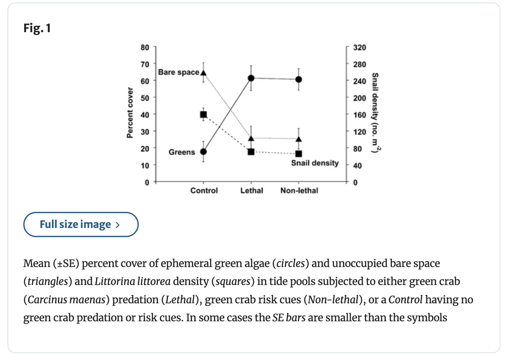

# Homework Setup

```{r setup, include=FALSE}
library(tidyverse)
library(janitor)
library(readxl)
library(here)


kelp <- read.csv("data/temp_kelp.csv")
caffeine <- read.csv("data/caffeinated_drinks.csv")

```

# Problem 1

# a.

The two appropriate tests are the Pearson correlation and the Spearman rank correlation. Pearson correlation measures the strength of a linear relationship between two continuous variables and assumes the data are normally distributed, while Spearman rank correlation measures the strength of a monotonic relationship using ranked data and does not require normality.

# b.

```{r}
#| label: visualization
#base layer: ggplot
ggplot(data = kelp,
       #x-axis: temperature
       #y-axis: kelp elongation
       mapping = aes(x = temp_c,
                     y = kelp_elong)) +
  #second layer: points for scatterplot
geom_point(color = "green", 
           size = 3) +
  #relabelling axes and title
  labs(x = "Temperature (°C)",
       y = "Kelp Elongation Rate (cm/day)",
       title = "As Temperature Increases, Kelp Frond Elongation Rate Decreases"
  ) +
  #changing theme from base
  theme_bw()

```


# c.

```{r}
#| label: assumptions
#running spearman rank correlation with temp and kelp elongation
cor.test(kelp$temp_c,
         kelp$kelp_elong,
         method = "spearman"
)

```

Spearman's p = -0.69

For the Spearman Rank Correlation, I checked for a monotonic relationship. I used the scatterplot in part 1b, which suggested a monotonic relationship, meaning that the assumption for Spearman's was met.

# d.

To evaluate the strength of the relationship between temperature and giant kelp frond elongation rate, I used a Spearman Rank Correlation, because it does not require the relationship between temperature and kelp elongation to be linear or the data to be normally distributed. We found a moderate to strong relationship between temperature and kelp frond elongation rate(Spearman's ρ = -0.69, S = 9216.1, p < 0.001, ⍺ = 0.05).

# e.

The Spearman Rank Correlation test shows whether there is a consistent monotonic relationship between temperature and giant kelp frond elongation rate. The Spearman's ρ = -0.69 suggests a moderate to strong negative relationship between temperature and kelp frond elongation rate. Thus, kelp frond elongates at a higher rate at lower temperatures, and inversely at a lower rate at higher temperatures.

# f.

```{r}
#| label: double-check
#running pearson rank correlation with temp and kelp elongation
cor.test(kelp$temp_c,
         kelp$kelp_elong,
         method = "pearson"
)
```

The Pearson Correlation test provided me with Pearson's r = -0.69, which is the same as the Spearman's ρ from Problem 1c. Pearson correlation tests for a linear relationship using raw values of temperature and kelp elongation rate, while Spearman correlation tests for a monotonic relationship using ranked values of the same variables. Both tests led me to the same result that there is a moderate to strong negative relationship between temperature and kelp frond elongation rate.


# Problem 2

# a.

```{r}
#| label: caffeinated-drinks-bar
#removing uppercase and spaces/periods
clean_caffeine <- caffeine |> 
  clean_names() 
#creating number of drinks data point
drink_counts <- clean_caffeine |>
  count(time_of_day, name = "num_drinks") 
#base layer: ggplot
ggplot(drink_counts, 
       #x-axis: time of day
       #y-axis: number of drinks
       #filling color based on time of day
       aes(x = time_of_day, 
           y = num_drinks, 
           fill = time_of_day)) +
  #second layer: bar plot
  geom_col() +
  #relabeling title and axes
  labs(title = "More Caffeinated Drinks consumed in the morning",
    x = "Time of Day",
    y = "Number of Drinks (count)"
  ) +
  #recoloring based on Time of Day
  scale_fill_manual(values = c("Morning" = "skyblue", 
                               "Afternoon" = "tomato",
                               "Evening" = "limegreen")) +
  #changing theme
  theme_bw() +
  #removing legend
  theme(legend.position = "none")

```

```{r}
#| label: caffeinated-drinks-points
#mutating times on the data table
drink_data <- clean_caffeine |> 
  mutate(hour = as.numeric(format(
    as.POSIXct(drink_date_and_time, format = "%m/%d/%Y %I:%M %p"),
    "%H"
  )))

#creating drinks per hour count
hourly_counts <- drink_data |>
  count(hour, name = "num_drinks")

#base layer: ggplot
ggplot(hourly_counts, aes(x = hour, y = num_drinks)) +
    #second layer: points
  geom_point(color = "purple", size = 3) +
    #relabeling title and axes
  labs(title = "Drink Consumption Peaks at 11AM",
       x = "Hour of Day (24-hour time)",
       y = "Number of Drinks (count)") +
   #changing theme from base
  theme_bw()
```

# b.

**Figure 1.** More caffeinated drinks consumed in the Morning (Morning:Blue, Afternoon:Red, Evening:Green). The amount of drinks consumed at each time of day is represented with a bar graph, with the height of the graph representing the number of caffeinated drinks consumed.


**Figure 2.** Most caffeinated drinks consumed at 11:00 AM. The x-axis has the time of day, while the y-axis is the count of drinks consumed, with the points(Purple) representing the amount of drinks consumed at each time of the day. 

# Problem 3

# a.

An idea I had for an affective visualization of my personal data would be to draw the bar graphs as coffee cups, with the cups filled up to the height of the bars. For the points graph, I could replace the purple dot representing my data with a drawing of the caffeinated drink most consumed at that time of day. For example, the 8PM point would be replaced with a drawing of a Strawberry milk tea, and most of the morning ones would be replaced by drawings of coffee cups and matchas.


# b.

# c.

# d.

# e.

# Problem 4

# a.

The statistical test used in this study is ANOVA, because the study is comparing more than two groups and the outcome variables are continuous.



# b.

The axes are logically positioned, with the double y-axis design justified by the overlay of two differently-scaled response variables. Means ± SE are shown for all data points, and the caption even states when SE bars fall within symbol size. The main weakness is the absence of  raw data, making it impossible to assess data distribution, outliers, or within-group variability beyond what SE captures. Another more minor issue is the undefined dashed vs. solid line styles.


